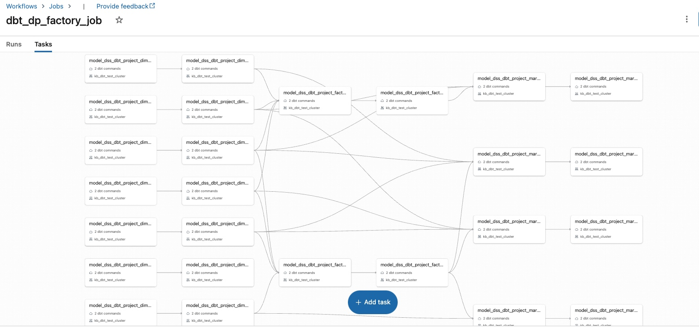

# dbt-dss-session
This is a sample repository for Databricks Specialist Session on dbt

This branch is enabled with dp factory, more details are here
[dbt-databricks-factory](https://github.com/getindata/dbt-databricks-factory)

It can create a databricks dbt job with model level tasks and same dbt_CLI cluster, that we define in our **cluster_config.json**, will be used for all the tasks.

**Screenshot of a sample dbt job:**
